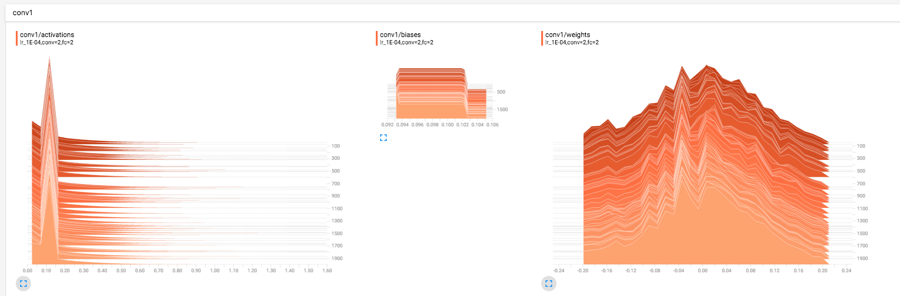

# Tensorflow-Wrap

TF has several wrappers such as keras, tf.contrib.slim etc. This is not to replace them, but some helper function to write code faster in TF only environments and also to fully utilize Tensorboard(from TF-dev summit Feb,2017).  

```python
# combine all summaries 
summ = tf.summary.merge_all()

# write summaries to file
writer = tf.summary.FileWriter(filename)
writer.add_graph(sess.graph) # adds graph too


# when run session 
...
...,s = sess.run([..., summ], feed_dict=...)
writer.add_summary(s, count)
```


## Conv Layer 
Use this to write a convolution layer with name space. It is very useful for plotting graphs in tensorboard. 
Modify speciific parameters according to use. This will write summary for weights, biases and activations. These can be visualized using Tensorboard

```python
def conv_layer(input, size_in, size_out,kernel_size,stride=1, layer_name="conv"):
  with tf.name_scope(layer_name):
    w = tf.Variable(tf.truncated_normal([kernel_size[0], kernel_size[1], size_in, size_out], stddev=0.1), name="W")
    b = tf.Variable(tf.constant(0.1, shape=[size_out]), name="B")
    conv = tf.nn.conv2d(input, w, strides=[1, stride, stride, 1], padding="SAME")
    act = tf.nn.relu(conv + b)
    tf.summary.histogram("weights", w)
    tf.summary.histogram("biases", b)
    tf.summary.histogram("activations", act)
    return act
```

## FC Layer 
Fully Connected layer 

```python
def fc_layer(input, size_in, size_out, layer_name="fc"):
  with tf.name_scope(layer_name):
    w = tf.Variable(tf.truncated_normal([size_in, size_out], stddev=0.1), name="W")
    b = tf.Variable(tf.constant(0.1, shape=[size_out]), name="B")
    act = tf.nn.relu(tf.matmul(input, w) + b)
    tf.summary.histogram("weights", w)
    tf.summary.histogram("biases", b)
    tf.summary.histogram("activations", act)
    return act
```

## Batch Norm 
Batch-Normalization Layer with trainable parameters.

```python 
def batch_norm_layer(input,size_out,layer_name = 'bn'):
  with tf.name_scope(layer_name):
    beta = tf.Variable(tf.constant(0.0, shape = [size_out]),name = 'beta', trainable = True)
    gamma = tf.Variable(tf.constant(1.0, shape = [size_out]),name = 'gamma', trainable = True)
    mean, variance = tf.nn.moments(input, [0, 1, 2])
    tf.summary.histogram("beta", beta)
    tf.summary.histogram("gamma", gamma)
    tf.summary.histogram("mean", mean)
    tf.summary.histogram("var", variance)
    return tf.nn.batch_normalization(input, mean, variance, beta, gamma, variance_epsilon=0.0001, name = 'op')
```

## Tensorboard Output


## Other Tensorflow Musings 

### Using convolution with initialization 
Instead of using conv2d as shown, there is more simpler way of writing conv2d layer as 
```python
conv2d_layer = tf.contrib.layers.conv2d(inputs,num_outputs,kernel_size, scope)
```
More details for this can be found [here](https://www.tensorflow.org/api_docs/python/tf/contrib/layers/conv2d)
As can be seen, there is already an `xavier_initializer` as well as activation with `relu`. This gives code simpler to read. 

### Print trainable variables 
There is no model printing function(as same as keras). So while using pure tensorflow, there are some prinitng capabilities in `tensorflow.contrib.slim`  as 
```python
init = tf.global_variables_initializer()
sess.init()
variables = tf.model_variables()
tf.contrib.slim.model_analyzer.analyze_vars(variables, print_info=True)
```


